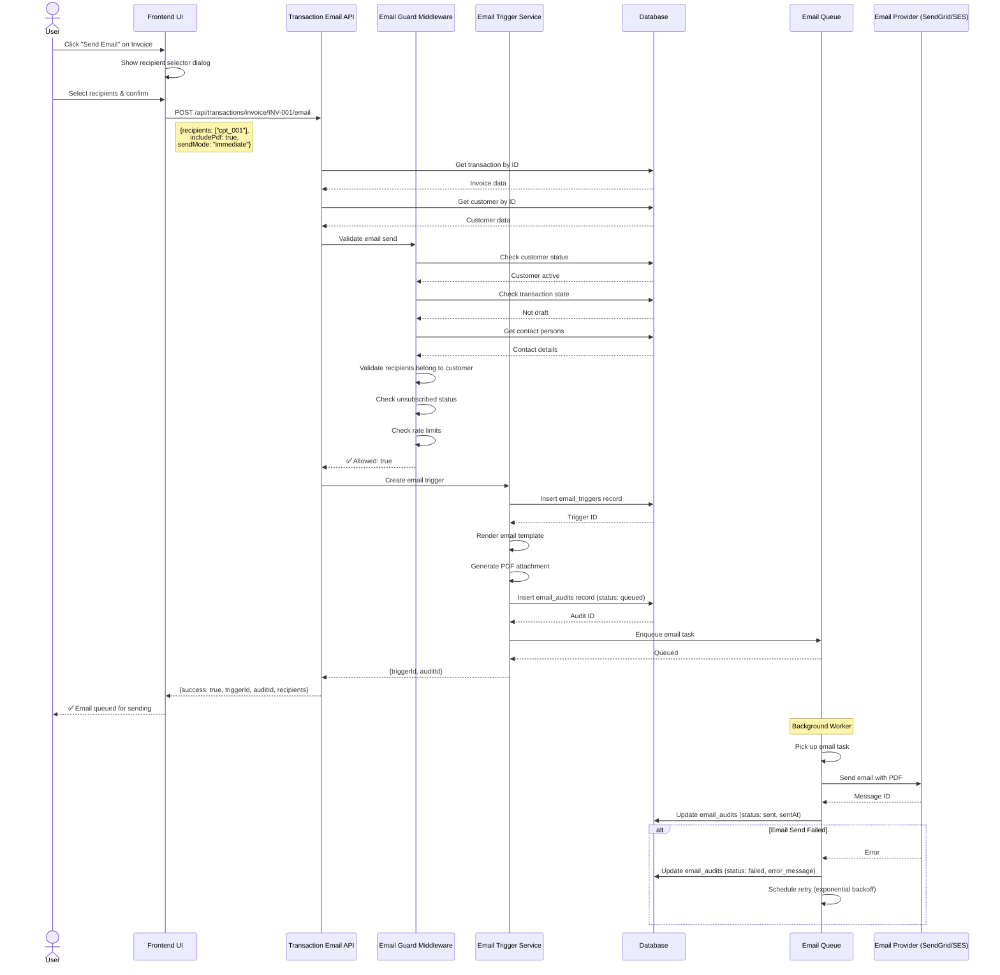
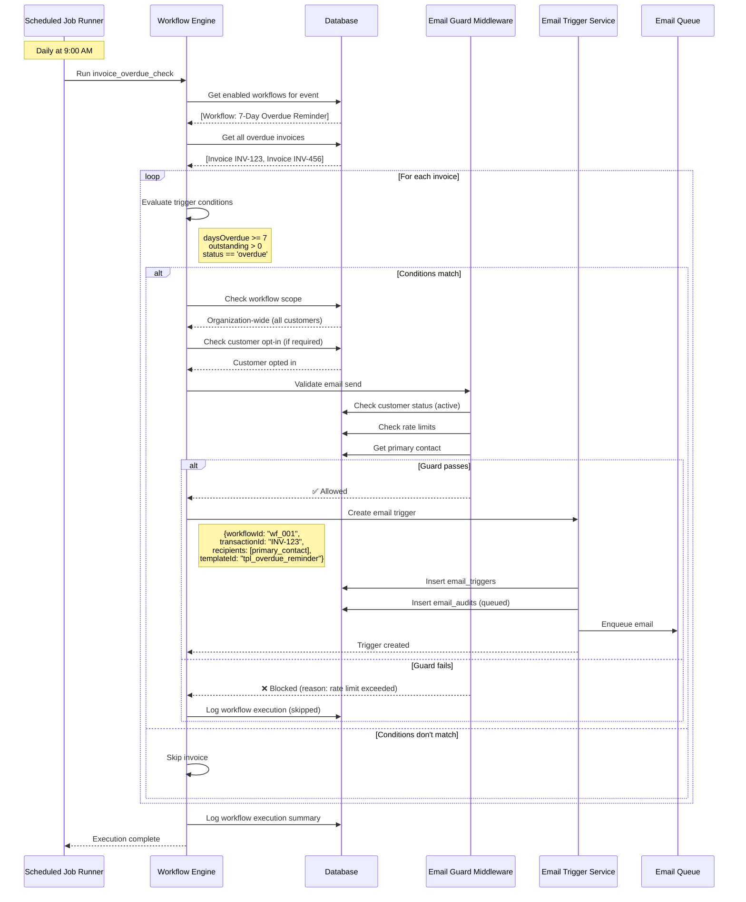
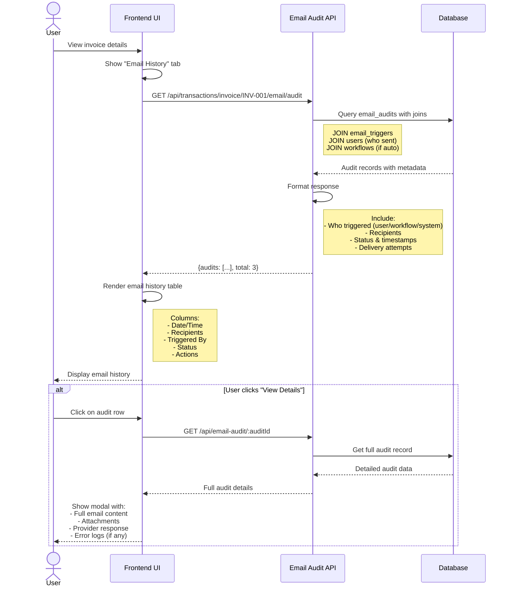
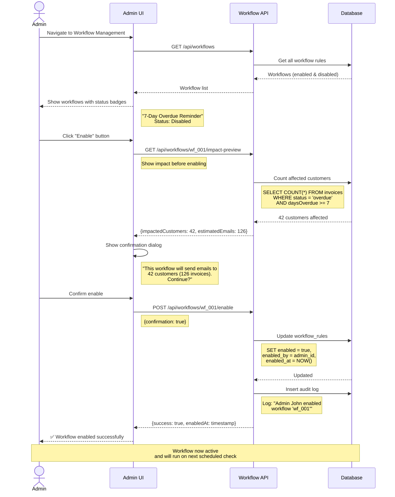
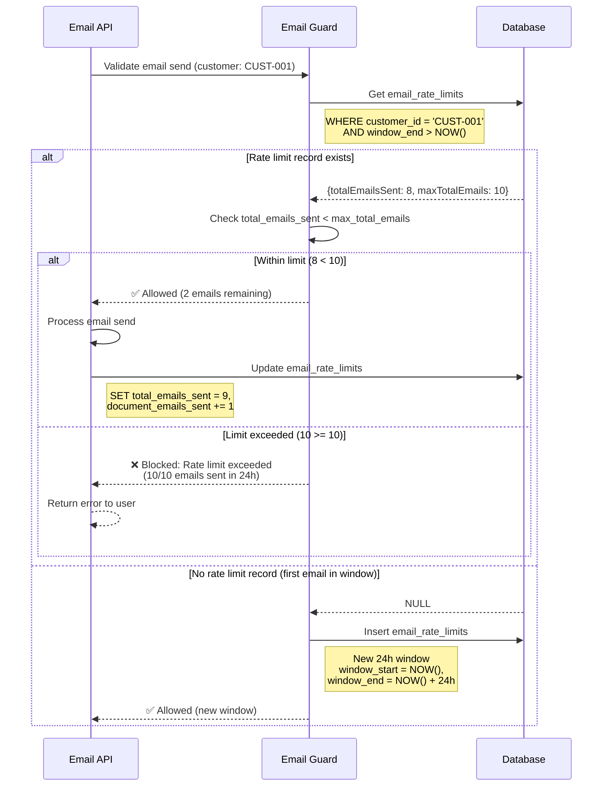
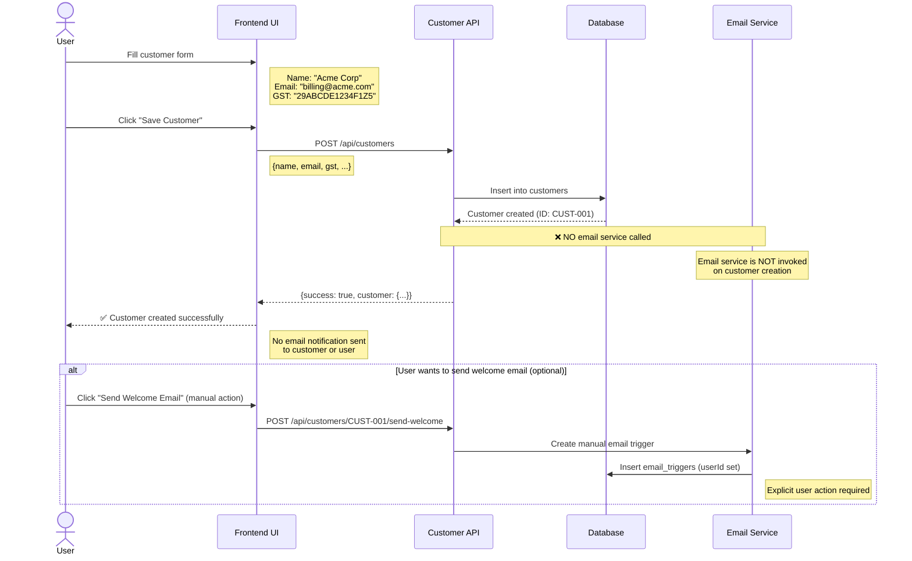
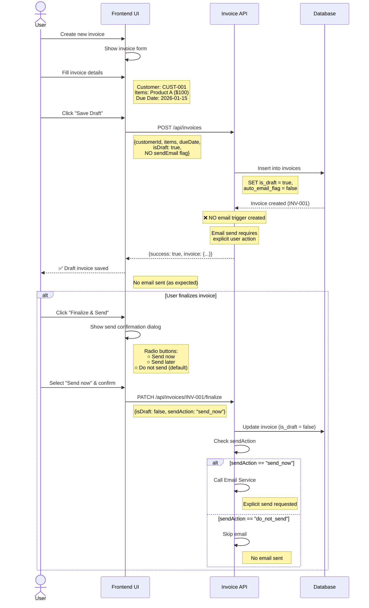

# Email System Sequence Diagrams

This document contains detailed sequence diagrams for the Customer Lifecycle Email System.

---

## 1. Manual Transaction Email Send



---

## 2. Workflow-Triggered Email (Overdue Reminder)



---

## 3. Unsubscribe Flow

```mermaid
sequenceDiagram
    actor Customer
    participant Email as Email Client
    participant Link as Unsubscribe Link
    participant API as Unsubscribe API
    participant DB as Database
    participant Guard as Email Guard
    
    Customer->>Email: Receive invoice reminder
    Email->>Customer: Display email with footer
    Note right of Email: Footer contains:<br/>"Unsubscribe from reminders"
    
    Customer->>Link: Click unsubscribe link
    Note right of Link: GET /api/unsubscribe<br/>?token=encrypted_contact_id
    
    Link->>API: Process unsubscribe request
    
    API->>API: Decrypt token
    API->>DB: Get contact person by ID
    DB-->>API: Contact details
    
    API->>DB: Update contact_persons
    Note right of API: SET unsubscribed = true,<br/>unsubscribed_at = NOW()
    
    DB-->>API: Updated
    
    API->>DB: Insert email_events
    Note right of API: event_type = 'unsubscribe'<br/>email_address = contact.email
    
    API-->>Link: Unsubscribe confirmed
    Link-->>Customer: Show confirmation page
    Note right of Customer: "You've been unsubscribed<br/>from reminder emails"
    
    Note over Customer,Guard: Future Email Attempt
    
    Guard->>DB: Validate recipients
    DB-->>Guard: Contact unsubscribed = true
    Guard-->>Guard: ❌ Block email send
    Guard-->>API: Error: Recipient has unsubscribed
```

---

## 4. Email Audit Query



---

## 5. Workflow Enable Flow (Admin)



---

## 6. Rate Limit Check Flow



---

## 7. Customer Creation (No Email)



---

## 8. Transaction Creation (Draft → No Email)



---

## Summary

These sequence diagrams illustrate:

1. **Manual Send:** User-triggered email with full guard checks
2. **Workflow Send:** Automated reminder with condition evaluation
3. **Unsubscribe:** Customer opt-out flow with guard enforcement
4. **Audit Query:** Historical email tracking and reporting
5. **Workflow Enable:** Admin activation with impact preview
6. **Rate Limit:** Per-customer email throttling
7. **Customer Create:** No email on internal business actions
8. **Transaction Draft:** No email until explicit user action

All flows enforce the **default-no-email principle** and require explicit user consent or workflow opt-in for customer communications.
